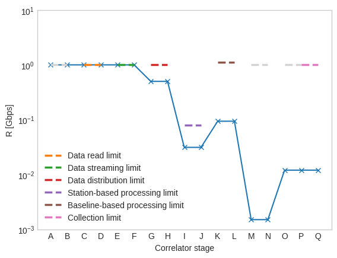
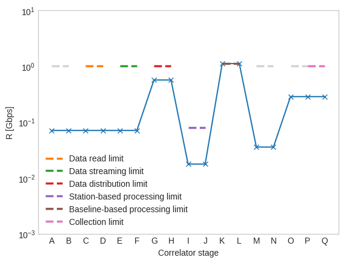
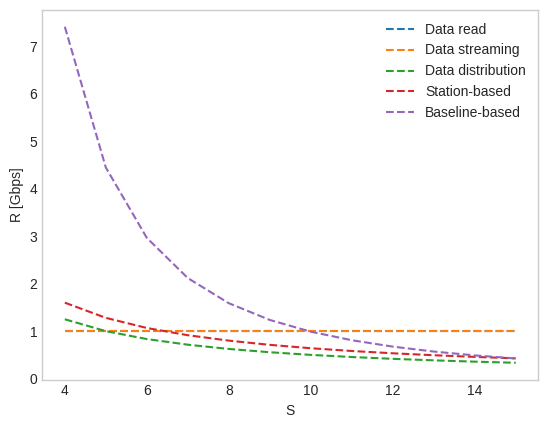
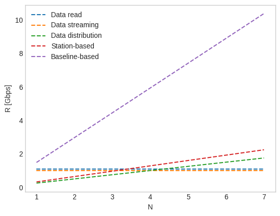

# Headroom Performance Model for Radio Interferometry Software Correlators

This repository presents a simple implementation of the performance characterization 
model presented in [A. J. Vázquez et al 2022 PASP 134 104501](https://doi.org/10.1088/1538-3873/ac8dc2) (Model-based Performance Characterization of Software Correlators for Radio Interferometer Arrays).

The objective of this project is simply to ease extensions of this work by providing a simple reference implementation. 

## Project structure

* **model**: headroom model framework. This implementation considers a general case, allowing for alternative architectures. The model is defined as a chain of scaling and limiting cells, and performance is computed in two iterations (first forward, then backward) that set the values of throughput at each stage of the correlation.
* **radio_model**: headroom model specific for radio interferometry software correlators. This corresponds to the model presented in the paper, allowing to override all parameters but defining default values for some of them. The defined constants may not necessarily match those in the paper, please set them properly depending on the case.
* **representation**: mixin for headroom graph generation.
* **test**: unit tests.

## Installation

```
python -m venv venv
source venv/bin/activate
pip install -e git+https://github.com/ajvazquez/correlator-headroom-model.git@master#egg=correlator-headroom-model
```

## Tests

```
python -m unittest
```

## Examples

### Headroom graph

The provided implementation allows to plot the performance in all stages of the correlator model easily.
The RIModel class allows to set all the parameters presented in the model, but provides some defaults for simplicity.

```
from correlator_headroom_model.radio_model import RIModel
S = 4
Nc = 8
kc = 16
RH = 1
RN = 1
m = RIModel(S, Nc, kc, RH, RN)
m.show()
```


It is also possible to show a minimal representation of the model (with the letters displayed in the graph), as well as the throughput at the input and the output of the correlator:
```
print("Rinmax = {} {}".format(m.get_r_in_max(), m.units))
print("Routmax = {} {}".format(m.get_r_out_max(), m.units))
m.show_blocks()
```
This yields:
```
Rinmax = 1.0 Gbps
Routmax = 0.012 Gbps
(A) [1] (B) |1.0> (C) [1] 'Data read limit' (D) |1.0> (E) [1] 'Data streaming limit' (F) |0.8> (G) [1] 'Data distribution limit' (H) |0.0625> (I) [0.08] 'Station-based processing limit' (J) |3> (K) [0.22] 'Baseline-based processing limit' (L) |0.016> (M) [1] (N) |5> (O) [1] 'Collection (network) limit' (P) [1] 'Collection (disk) limit' (Q) 
```
For simply displaying the throughput R at the input:
```
print(m.R, m.units)
```
This yields:
```
1.0 Gbps
```
Another example increasing S and kc:
```
S = 64
kc = 32
m = RIModel(S, Nc, kc, RH, RN)
m.show(ymin=1e-3, ymax=10)
```


```
print(m.R, m.units)
```
This yields:
```
0.07060317460317461 Gbps
```


### Specific limits and parameter ranges: csv

This example shows how to generate csv data with all the computed limits. 
By using the parameter filter_limit when initializing the model it is possible to bypass all limits except those matching
the criteria.
```
from correlator_headroom_model.radio_model import RIModel
S = 4
Nc = 5
kc = 16
RH = 1
RN = 1
limits = ["Data read", "Data streaming", "Data distribution", "Station-based", "Baseline-based"]

print("S,"+",".join(limits))
for S in range(2,14):
    values = [S]
    for limit in limits:
        m = RIModel(S, Nc, kc, RH, RN, filter_limit=limit)
        values.append(m.R)
    print(",".join(list(map( str,values))))
```
This yields:
```
S,Data read,Data streaming,Data distribution,Station-based,Baseline-based
2,1.0,1.0,2.5,3.1999999999999997,44.480000000000004
3,1.0,1.0,1.6666666666666667,2.1333333333333333,14.826666666666668
4,1.0,1.0,1.25,1.5999999999999999,7.413333333333334
5,1.0,1.0,1.0,1.28,4.448
6,1.0,1.0,0.8333333333333334,1.0666666666666667,2.9653333333333336
7,0.9999999999999999,0.9999999999999999,0.7142857142857143,0.9142857142857144,2.1180952380952385
8,1.0,1.0,0.625,0.7999999999999999,1.5885714285714285
9,1.0,1.0,0.5555555555555556,0.7111111111111111,1.2355555555555557
10,1.0,1.0,0.5,0.64,0.9884444444444446
11,1.0,1.0,0.45454545454545453,0.5818181818181818,0.8087272727272727
12,1.0,1.0,0.4166666666666667,0.5333333333333333,0.6739393939393941
13,1.0,1.0,0.3846153846153846,0.4923076923076923,0.5702564102564103
```

### Specific limits and parameter ranges: plot varying S

This example shows how to represent the model limits for a benchmark varying the number of stations S.
```
import matplotlib.pyplot as plt
plt.style.use('seaborn-whitegrid')

from correlator_headroom_model.radio_model import RIModel

S = 4
Nc = 5
kc = 16
RH = 1
RN = 1
limits = ["Data read", "Data streaming", "Data distribution", "Station-based", "Baseline-based"]

fig, ax = plt.subplots()
ax.grid()

S_range = range(4,16)
for limit in limits:
    values = []
    for S in S_range:
        m = RIModel(S, Nc, kc, RH, RN, filter_limit=limit)
        values.append(m.R)
    ax.plot(S_range, values, linestyle="--", label=limit)
ax.legend(loc="upper right")
plt.xlabel("S")
plt.ylabel("R [Gbps]")
```


### Specific limits and parameter ranges: plot varying N

This example shows how to represent the model limits for a benchmark varying the number of nodes N.
```
import matplotlib.pyplot as plt
plt.style.use('seaborn-whitegrid')

from correlator_headroom_model.radio_model import RIModel


S = 4
Nc = 5
kc = 16
RH = 1.1
RN = 1
limits = ["Data read", "Data streaming", "Data distribution", "Station-based", "Baseline-based"]

fig, ax = plt.subplots()
ax.grid()

N_range = range(1,8)
for limit in limits:
    values = []
    for Nc in N_range:
        m = RIModel(S, Nc, kc, RH, RN, filter_limit=limit)
        values.append(m.R)
    ax.plot(N_range, values, linestyle="--", label=limit)
ax.legend(loc="upper left")
plt.xlabel("N")
plt.ylabel("R [Gbps]")
```


## Disclaimer

Please take into account that the default parameters set in this implementation are not intended to be applied directly to any correlation scenario, please approach
this implementation after reading the [paper](https://doi.org/10.1088/1538-3873/ac8dc2), and set the model parameters carefully.

This implementation has been prepared after the paper.
In case of differences between this implementation and the article, the theoretical model in the paper takes full precedence.
